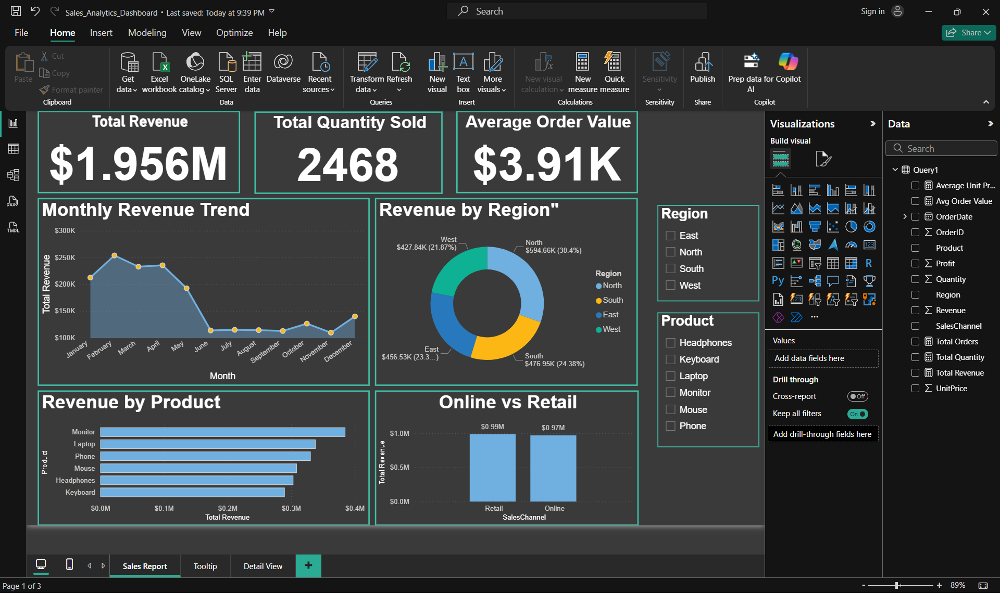

# Sales-Analytics-PowerBI-Project
End-to-end Data Analytics project using Excel, MySQL, and Power BI

# 📊 Sales Analytics Dashboard — Excel | SQL | Power BI

## 🧠 Objective
To perform end-to-end analysis of sales data to uncover key business insights — such as best-selling products, regional performance, and revenue trends — using Excel, SQL, and Power BI.

---

## 🧰 Tools Used

| Tool | Purpose |
|------|----------|
| **Excel** | Data cleaning, preprocessing, exploratory analysis |
| **MySQL** | Data storage, querying, aggregation & analysis |
| **Power BI** | Interactive dashboard creation & storytelling |
| **GitHub** | Documentation & version control |

---

## 📂 Project Files

| File | Description |
|------|-------------|
| `sales_dataset.csv` | Raw dataset (500 rows) cleaned in Excel |
| `analysis_queries.sql` | SQL scripts used for analysis |
| `Sales_Analytics_Dashboard.pbix` | Power BI dashboard file |
| `dashboard_preview.png` | Dashboard screenshot |

---

## 🧩 Step 1 — Data Cleaning (Excel)

### Tasks Performed
1. Imported raw sales data and checked for:
   - Missing values  
   - Duplicates  
   - Incorrect date and number formats
2. Created new calculated columns:
   - `Revenue = UnitPrice * Quantity`
   - `Profit = Revenue * 0.2` (assumed 20% margin)
3. Used Pivot Tables for early insights:
   - Revenue by Region  
   - Product Performance  
   - Monthly Sales Trends
4. Exported final cleaned dataset to CSV (`sales_dataset.csv`).

### Snapshot of Cleaning Steps
| Task | Excel Feature Used |
|------|--------------------|
| Removing Duplicates | Data → Remove Duplicates |
| Formatting Dates | Format Cells → Date |
| Calculating Revenue | Formula: `=UnitPrice * Quantity` |
| Exploratory Pivot Charts | Insert → Pivot Table |

---

## 🧠 Step 2 — Data Analysis (MySQL)

### Database Creation
```sql
CREATE DATABASE sales_analysis;
USE sales_analysis;


